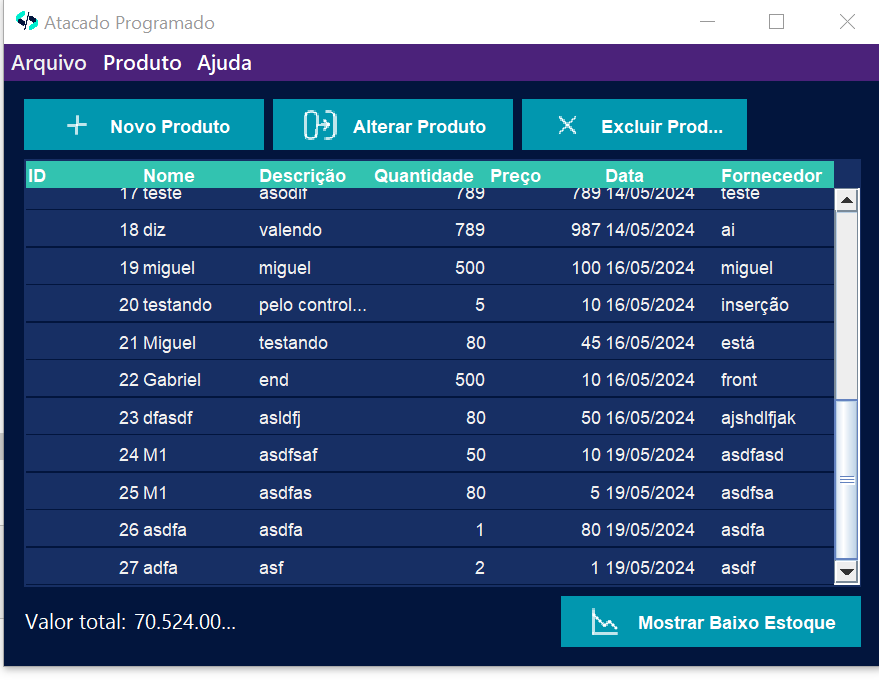
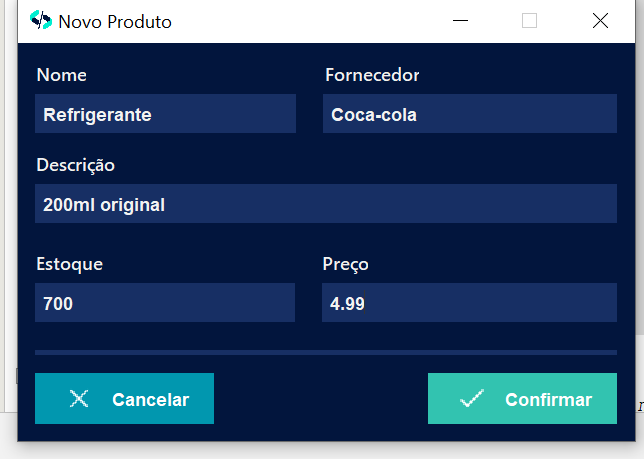
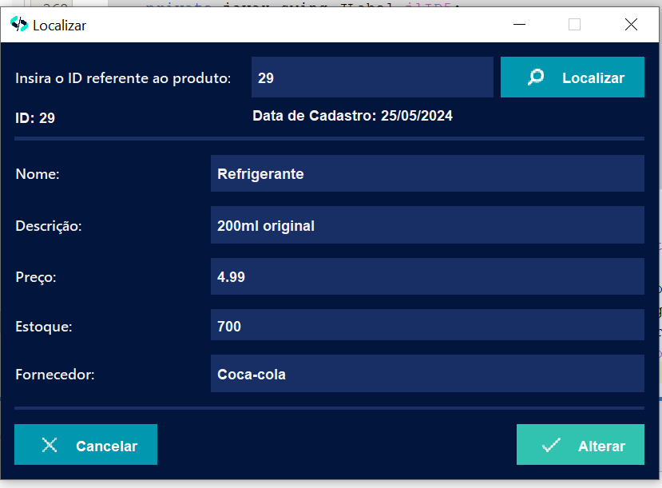
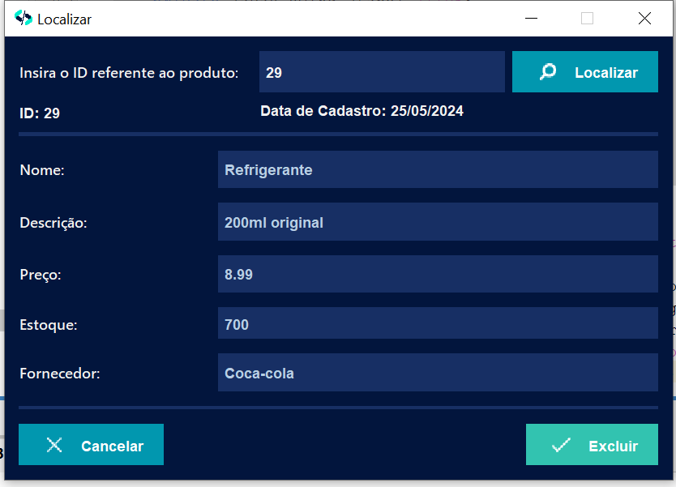
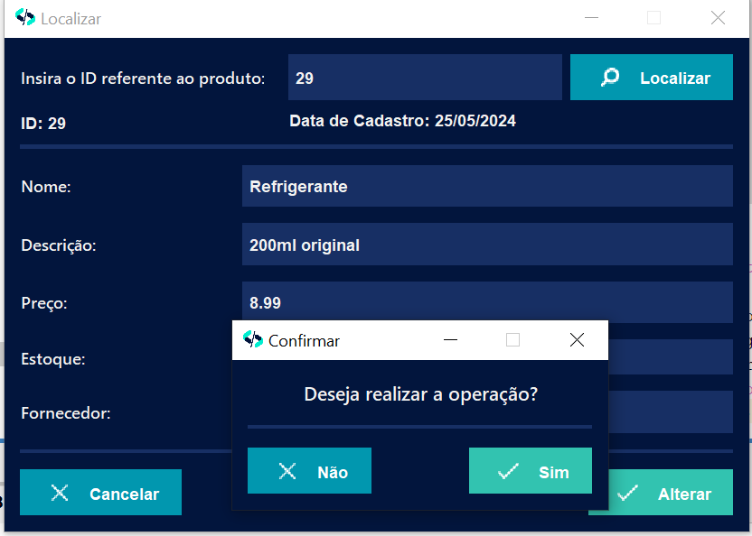

<h1 align="center">Atacado Programado </h1> 

  

 

  <a href="#about">Sobre </a> •
  <a href="#tech">Ferramentas</a> •
  <a href="#features">Funcionalidades</a> •
  <a href="#author">Autores</a> 

<a name="about"> <h2> 📚 Sobre o Projeto</h2> </a> 

 O projeto simula uma aplicação de controle de estoque de produtos.

 
 
 
 
  

   
<a name="tech"> <h2>🛠️ Ferramentas </h2> </a>
==========================================
  Ferramentas utilizadas para este projeto
- Java
- [Netbeans](https://netbeans.apache.org/front/main/index.html)
- [MySql](https://dev.mysql.com/doc/refman/8.0/en/)
- [MySql Workbench](https://dev.mysql.com/doc/workbench/en/)
- Java Swing
- [Github](https://github.com/)
      
<a name="features"> <h2> ⚙️ Funcionalidades </h2> </a>
============================================
- [x] Criar novo Produto
- [x] Editar Produto
- [x] Deletar Produto
- [x] Persitência de Dados
- [x] Mostrar produtos com estoque abaixo de 100.
- [x] Mostrar soma total de todos os produtos.

<a name="author"><h2>🙋‍♂️ Autores </h2></a>
======================================
 <b>Miguel Santos da Silva - Ciência da Computação  
 Gabriel Henrique Passos da Silva - Ciência da Computação 
 Henrique Antony - Ciência da Computação 
 Vitor Emanuel Azevedo Nora e Silva Junior - Ciência da Computação 
 Victor Samuel - Sistemas de Informação 
 </b>
